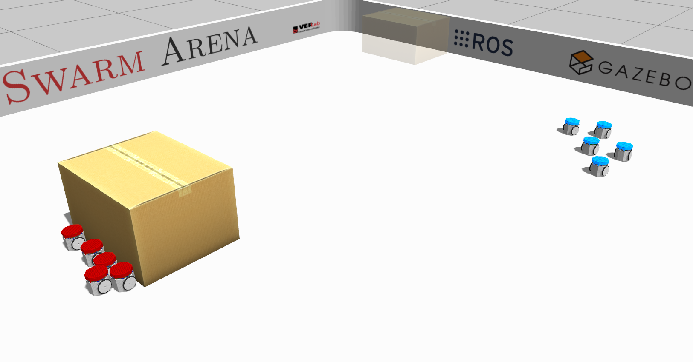
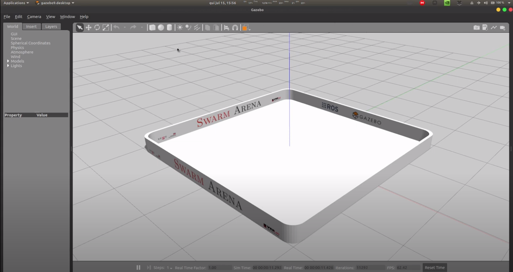
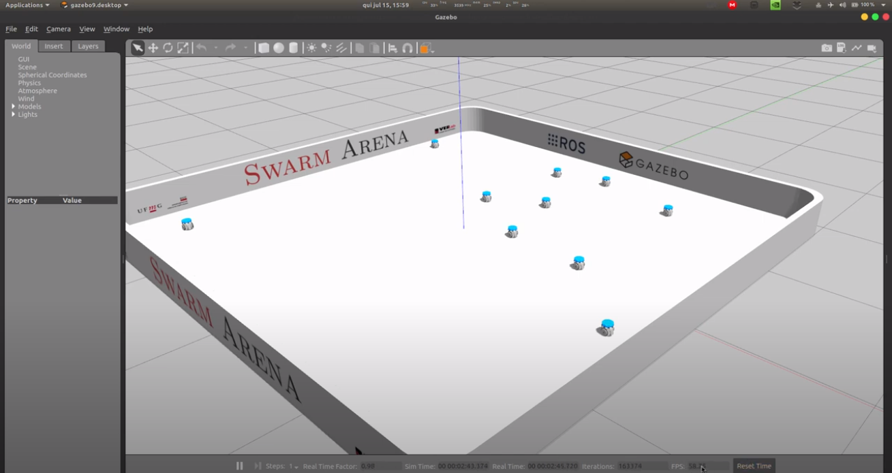

# Collective Transport using Gibbs Random Fields
```2021 IEEE/RSJ International Conference on Intelligent Robots and Systems```

```September 27 - October 1, 2021 Prague, Czech Republic, Online```

## Abstract
This paper presents a novel methodology that allows a swarm of robots to perform a cooperative transportation task. Our approach consists of modeling the swarm as a Gibbs Random Field (GRF), taking advantage of this framework's locality properties. By setting appropriate potential functions, robots can dynamically navigate, form groups, and perform cooperative transportation in a completely decentralized fashion. Moreover, these behaviors emerge from the local interactions without the need for explicit communication or coordination. To evaluate our methodology, we perform a series of simulations and proof-of-concept experiments in different scenarios. Our results show that the method is scalable, adaptable, and robust to failures and changes in the environment.

<p align="center">
  
</p>


## Dependecies

-   [ROS Melodic](http://wiki.ros.org/melodic/Installation)
-   [HeRo Gazebo](github.com/verlab/hero_common)


## Installation

-   Using git (or download the zip file) clone this repository into the "source code" folder of your ROS workspace (e.g. ~/catkin_ws/src ).

```sh
$ cd ~/catkin_ws/src
$ git clone https://github.com/verlab/grf_colletive_transport.git
$ git clone https://github.com/verlab/hero_common.git
$ catkin build # or catkin_make
```

## Usage

- How to run the algorithm proposed in this work?

### Launching HeRo gazebo
```sh
$ roslaunch hero_gazebo gazebo_bringup.launch 
```
<p align="center">
  
</p>

### Start our code
- Use the script ```spawn_multi_robots_launch.py``` to create a ```.launch``` file with a pre-set environment.
```sh
$ python spawn_multi_robots_launch.py --help
usage: spawn_multi_robots_launch.py [-h] [--robots ROBOTS] [--groups GROUPS]
                                    [--sensing SENSING]
                                    [--worldsize WORLDSIZE]
                                    [--safezone SAFEZONE] [--dt DT]
                                    [--mass MASS] [--vmax VMAX] [--seed SEED]
```
- For example:
```sh
$ python3 spawn_multi_robots_launch.py --robots 80 --groups 4 > swarm.launch
```
- Now, launch the file using ros and then the robots should start spawning on Gazebo.
```sh
$ roslaunch grf_transport swarm.launch
```
- Initial our transport controller
```sh
$ rosrun grf_transport grf_rl_transport_node
```

<p align="center">
  
</p>


## Citation
- HeRo Gazebo:
```
@inproceedings{rezeck2017hero,
  title={HeRo: An open platform for robotics research and education},
  author={Rezeck, Paulo and Azpurua, Hector and Chaimowicz, Luiz},
  booktitle={2017 Latin American Robotics Symposium (LARS) and 2017 Brazilian Symposium on Robotics (SBR)},
  pages={1--6},
  year={2017},
  organization={IEEE}
}
```
- This work:
```
@inproceedings{rezeck2021collective,
  title={Collective Transport using {Gibbs} Random Fields},
  author={Rezeck, Paulo and Assunção, Renato M. and Chaimowicz, Luiz},
  booktitle={2021  IEEE/RSJ International Conference on Intelligent Robots and Systems (IROS)},
  year={2021},
  organization={IEEE}
}
```
